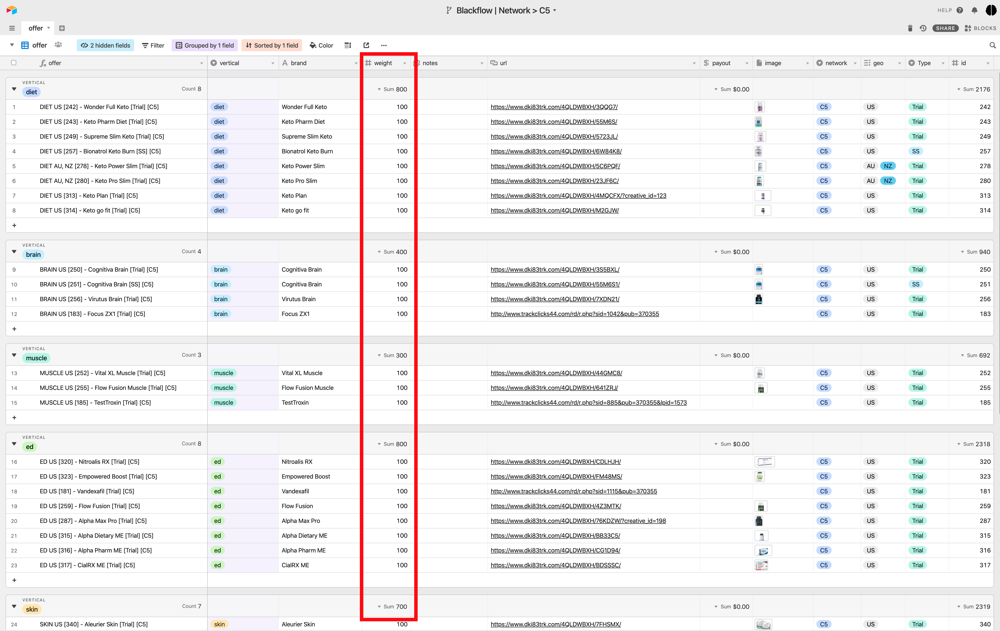

# 🏦 Network

## Network 

Instructions for networks putting their offers on blackflow

It's pretty straightforward. All you have to do is :

* if offer is capped and the traffic should be  paused, put the weight to 0
* to add a new offer, insert a record with name, url, offer image.
* if one of your offers is performing better and we should allocate more traffic to it, then adjust the weight. ie:  offer A 100, offer B 50, offer C 50
* set the status field as either:
  * active
  * paused \( not accepting any traffic \)
  * capped \( temporarily not accepting traffic \) 

