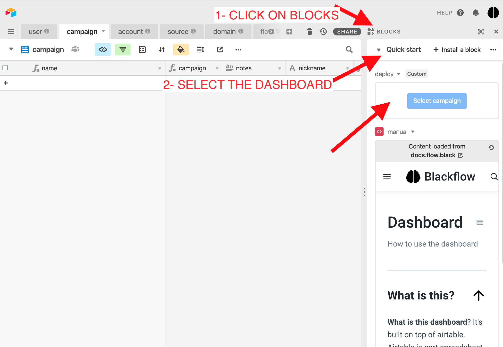

# 🚀 Start here



## Getting started


**What is this dashboard**? It's built on top of airtable. Airtable is hybrid spreadsheet and database.


Let's get a quick overview of airtable.

* This is your **base.** A [**base**](https://support.airtable.com/hc/en-us/articles/360021518753#base) is a database that contains all of the information you need about your campaigns,  and is made up of one or more tables.
* You've got different **tables.**  A [**table**](https://support.airtable.com/hc/en-us/articles/360021333094#table) contains a list of items of the same type. See it as ****the pieces of the puzzle : account, domain, landers...
* A [**record**](https://support.airtable.com/hc/en-us/articles/360021333094#record) is an individual item in a table \( campaign, domain etc.. \) 
* You can [**expand a record**](https://support.airtable.com/hc/en-us/articles/360021333094#expanded) to see all its associated details in a card-like layout.
* Then you have **views,** which is a way to filter which columns you want to see, so you can focus on your current task \( setting up campaign, scheduling...\). You can also share a view to your VA \( more on that later \)

For any questions about how to use airtable, please refer to this 



### Setting up your first campaign

#### STEP 1 - Add an account.

You start by adding an account. Go to account table.

You need to assign a source and a user . Optionally you can set up the **status** which is just to help you organize things \( which account are live, in review etc.. \) and the account pixel.

#### STEP 2 - Then you can create your campaign

Go to campaign table

You can see it as a puzzle, and you need to set these:

* the **traffic source**
* the **account** \(we just added\)
* the **flow** \( which vertical, geo and device \)
* the [**integration**](doc.md#integration), which is the type of safe page you want to use. You either have:
  *  wordpress, an article as safe page 
  *  reverse proxy, where you can use any external website as your safe page \( more on that later..\)
* **Domain**. For the domain, if you already have domain available in your base, you can assign them manually. If you need a new domain, click on the deploy, this will assign you a new domain based on your safe page settings


Don't see the deploy button? On the right side, click on BLOCKS to show the right side panel, then select the Campaign Dashboard.


That's all. Once you get a domain, you will see your campaign URL. All is ready, you can use it in your traffic source.

### Activating your campaign 

The last step is to activate your campaign after the traffic source approved it. This will turn the cloaker on so only do this when you are sending real traffic.

### Checking your campaign

How do i check my campaign to make sure it's working?

* Try loading your campaign link, it will go to the safe page. 
* Then add &{pubkey}=bypass in your campaign link to check the money page. \( you need to replace {pubkey}, with the one is your profile \).

More details here:



## Manage your Campaign

### Campaign status

A good way to manage your campaign and accounts is to set the status of the campaign. \( This has no effect on the cloaker, it's just for organization \). 


What if your campaign didn't approved or get banned? Then set up your campaign status as **disabled** and in _notes_ you can indicate the reason. This is very helpful as i can understand why you got disapproved and make improvements.


#### Status

* **Setting up**: we are still setting up the campaign on your dashboard
* **Ready**: link is working and ready to be uploaded on traffic source
* **Warming up**: campaign is warming up on safe page on traffic source
* **Live** : campaign is active. = Only case where you activate campaign
* **In review**: the campaign went into review \( pause the campaign
* **Disabled** : meant the campaign got rejected, or account disabled
* **Issue** : if your link is not working

So usually, the campaign life cycle is: Setting up -&gt; Ready -&gt; Warming up -&gt; Live -&gt; Disabled

### Campaign scheduler



## Landers

### How to add safe page



### How to add money page

_coming soon. for now send over chat_

## Offers

### How to add offers

_coming soon. for now send over chat. Only high volume users or private deal._

