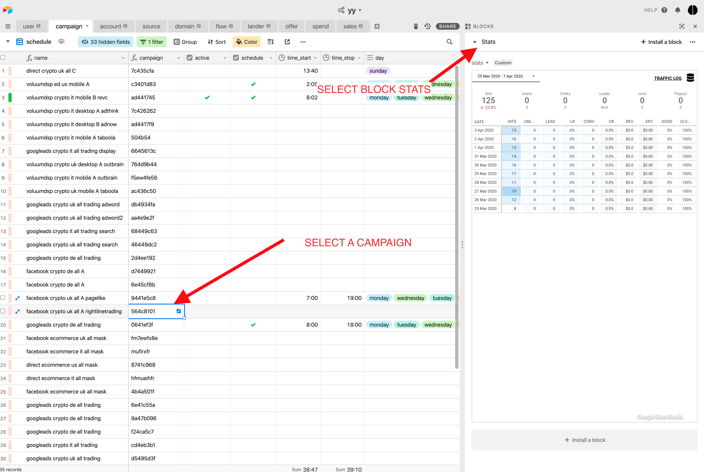
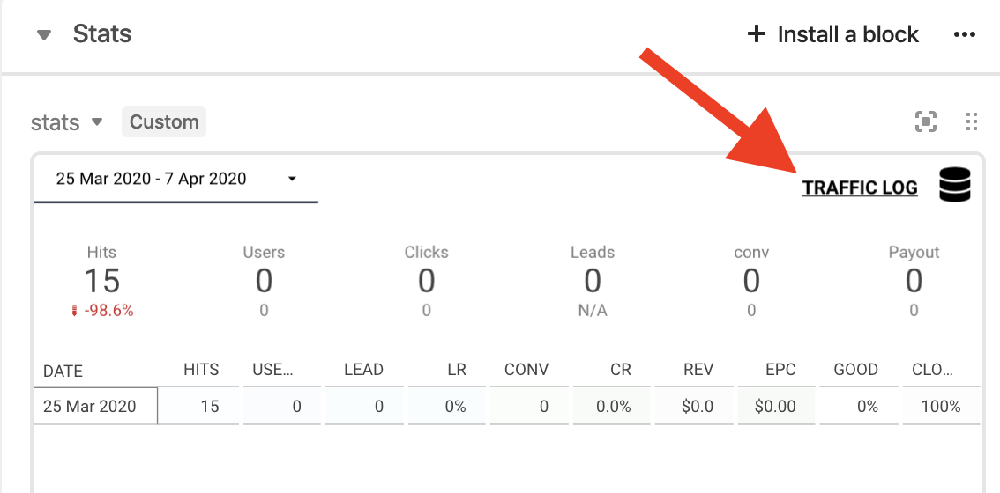
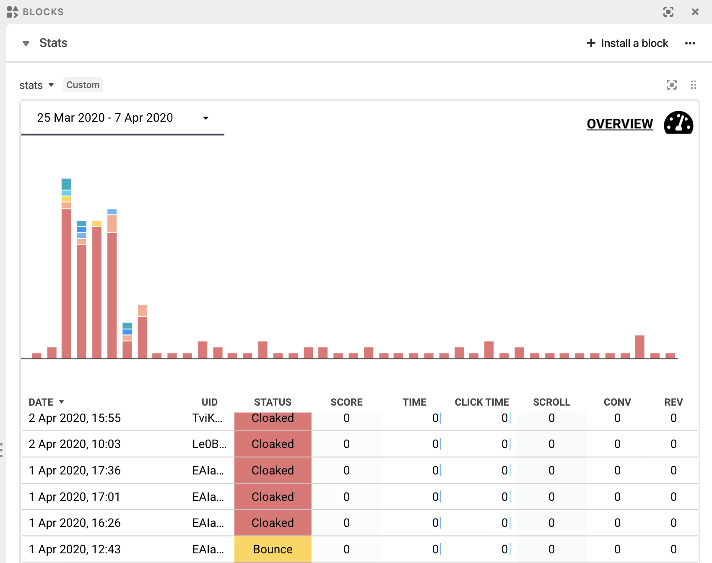

# Stats

You've got a few ways to check your stats, each with different level of details. 

### Table accounting

The _table accounting_ reports your daily revenue. You can see your current balance, pending payments, and payments sent.

### Table stats

The _table Stats_ report **your revenue per campaign per day**. This allows you \( or your VA \) to import your ad spend for each so we can compute your CPC, ROI and Profit.

### Block stats = analytics lookup

We have a block for your stats. Select any campaign, or any account to view it. It's a simple report with the most important metrics \( users, click, lead, click time, sales, cloak \) 

You can also switch between **Traffic log \(** see each click \)  and **Overview \(** stats by day **\)** 

## Analytics



